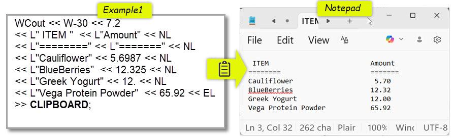
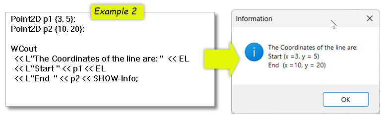

# WCout (C++, Windows)

WCout is a simple, consistent output and dialog utility for C++ on Windows.

It provides a single, readable chaining syntax where applicable (`<<`) to format text and numbers and send output (`>>`) to the clipboard, memos, or strings.





WCout uses standard Win32 APIs and should work with any Windows IDE or framework. 
It was developed and tested using Embarcadero C++Builder (see screenshots in the manual).


Dialog functions accept multiple/optional parameters and return a result, use native Windows API semantics. (vs. `<<`)

---
## Example

```cpp
WCout << "Pi = " << FF-7.2 << PI << SHOW;
WCout << LongMessage >> CLIPBOARD;
```
---


## Key ideas

- One consistent `<< / >>` chaining syntax where applicable
- Formatting, dialogs, and output targets use the same model
- Display text, numbers, and user-defined types
- No external libraries
- Drop-in `.cpp` / `.h` files

## Quick start

- Add `WCout.cpp` to your project
- Include `WCout.h` where you want to use WCout
- Build — no external libraries or complex setup required

That’s it.
## Documentation

A full illustrated user manual is available as a PDF:

[WCout User Manual (PDF)](docs/WCout_User_Manual_v1.pdf)

The manual shows:

- Real examples
- Matching source and results
- Formatting behavior
- Dialog usage
- Clipboard and memo output

## Support
If my tool saves you time or simplifies your work consider supporting future improvements with a coffee ☕ [My KO-FI website](https://ko-fi.com/michell777)

## Status
WCout is stable and actively documented.
The focus is clarity, consistency, and minimal friction for everyday debugging and output.